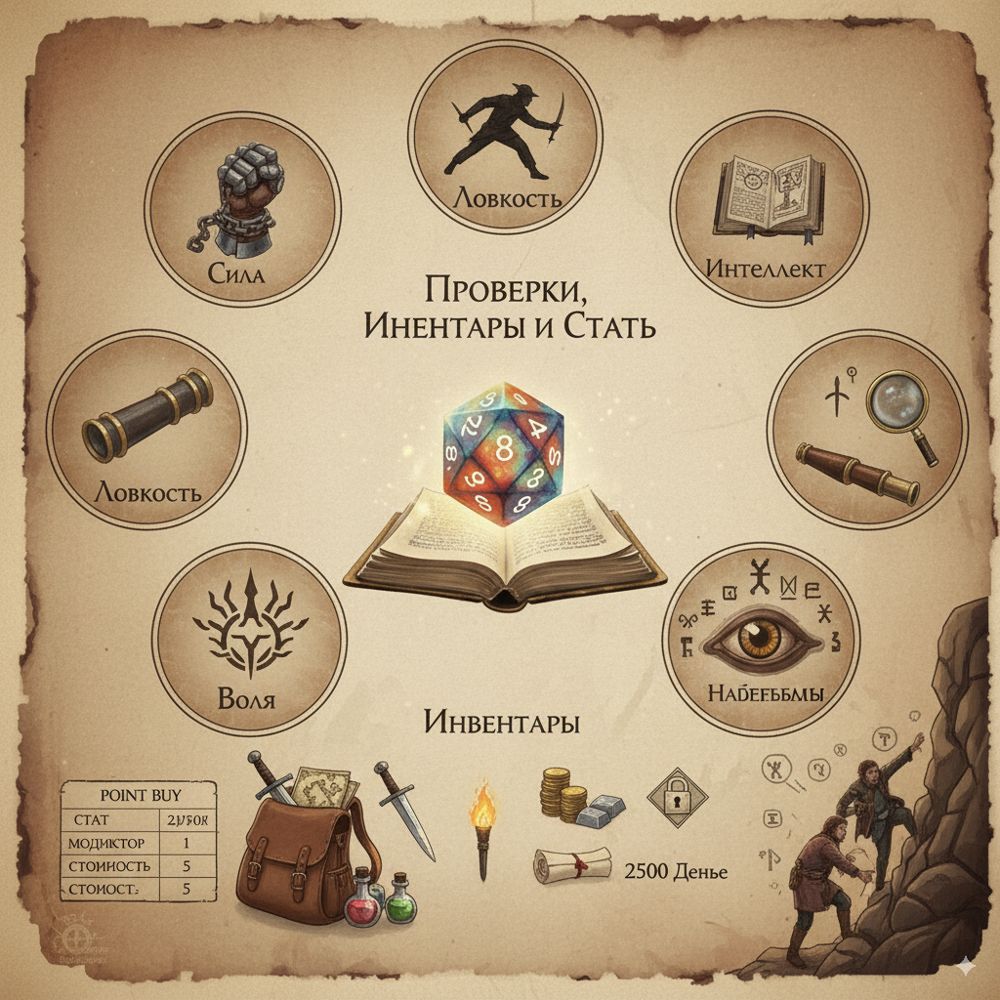

Есть 5 характеристик: Сила, Ловкость, Интеллект, Наблюдательность, Воля.

Все проверки - 2d12.

Значения характеристик - 1-12 (у врагов и НПЦ может быть ниже и выше). Стандартное значение - 6, модификатор 0. Модификатор повышается и понижается с каждым числом; например, 12 = +6, 1 = −5.

Модификатор меняет нижний и верхний пределы значений. Например, при модификаторе +2 нижний предел = 1+2 = 3, то есть из броска d12 возможны результаты, которые интерпретируются как {3, 3, 3, 4, 5, 6, 7, 8, 9, 10, 11, 12}; если выпало, например, 2, считается, что выпало 3. При модификаторе −3 максимальное значение = 12−3 = 9, то есть если выпадет 11, всё равно считается, что выпало 9.

К итоговому значению прибавляется модификатор умения или экспертизы, если он есть: +2 или +4 соответственно.

В игре нет испытаний как отдельной механики, но могут требоваться проверки конкретных навыков (например, Концентрация - один из навыков Воли).

Чем больше отклонение модификатора от 0, тем сильнее эффект. Например: при бонусе +5 средняя проверка имеет 66,7% шанс на успех, а при +6 - успех гарантирован; поэтому не рекомендуется держать значения близко к 0, однако в некоторых статах математика такова, что это будет необходимо.

## Встречные проверки

В игре достаточно часто встречаются встречные проверки - то есть ситуации, когда 2 стороны обе делают ту или иную проверку, и побеждает та, которая бросает лучше результат.
В таких случаях иногда Мастер может дать одной из сторон бонус к проверке.

## Перенапряжение

После того как вы делаете проверку, вы можете получить 1 уровень, на выбор, Усталости или Истощения, или также если это проверка Интеллекта, Наблюдательности или Воли - Стресса, или если это проверка Силы или Ловкости - уровень Ранения.

- Если вы это делаете, вы можете увеличить результат проверки на 3, и таким образом потенциально изменить результат. Одну проверку можно улучшать сколько угодно раз.

- Повышение результата на продолжительных проверках, когда одна проверка представляет деятельность на протяжении от 1 до 10 минут, увеличивает результат лишь на 1. Разговоры как правило считаются такой проверкой.

- Если продолжительная проверка занимает более 10 минут, повышение результата нельзя использовать.

Неигровые персонажи не могут повышать свой результат, хотя могут иметь отдельные способности с похожим эффектом.

Также, если кто-то хочет помочь в какой-то проверке, это не увеличивает вероятность успеха, но позволяет помогающему делать Повышение результата в изначальной проверке.

## Характеристики

ХП определяется классом и чертами и повышается на 1 за каждый уровень.  
Броня повышает использование импульса на большинстве атак против персонажа и, как правило, равна 0-3.  
Импульс - лимит действий и реакций за ход. Равен 15 + значение основной характеристики класса (1-12) + уровень персонажа + потенциально модификатор второй характеристики (у чемпиона и плута).
Уровень персонажа - 1-10.  
Опыт - 0-10. За каждые 10 опыта персонажи повышают уровень. Персонажи получают 1 единицу опыта, когда происходит событие, понижающее мораль команды на 1, и получают 2 опыта, когда происходит событие, повышающее мораль команды на 1.  
Мораль - характеристика команды, влияющая на получение опыта и нарративные эффекты (Более подробно о ней в [[Вне боя]]).

## Инвентарь и оружие

Помимо оружия в руках, каждый персонаж может носить ещё три оружия в отдельных слотах, однако если вы хотите спрятать оружие в руке, то должно быть место в инвентаре для этого. Всё остальное оружие должно находиться в инвентаре; почти всё оружие использует 3 слота предметов. Надетая одежда и броня не используют слотов инвентаря. Персонажи могут носить с собой до одного рюкзака и до четырёх предметов вне рюкзака. В рюкзаке можно хранить до 8 предметов.

Также, вы можете хранить до 2500 Денье не используя слоты инвентаря. Пользоваться этими деньгами можно только находясь в безопасном месте (Как правило, цивилизованные поселения). Если какие-то деньги вы нашли в своих приключениях, то вы их обязаны держать в инвентаре до тех пор, пока не окажетесь в безопасном месте.
Нарративно, эти деньги представляют из себя деньги спрятанные, деньги которые вы держите билетами, обещания и обязательства торговцев, и т.д., и до 2500 Денье особого смысла отыгрывать подобное нет, ровно как и описывать перевозку и хранение этих денег.

Вы можете использовать 2 оружия в 2 руках, но это увеличивает стоимость всех Приемов оружия на 1, если только оба этих оружия не являются легкими или одно из них не является щитом.

## Point Buy

По стандарту у персонажа 5 очков характеристик, стандартное значение - 6; при создании можно изменить характеристику на любое значение от 1 до 10. Значения 11 и 12 можно получить только при повышении характеристик. За повышение уровня даются дополнительные очки, которые можно использовать для повышения характеристик; неиспользованные очки при создании персонажа не сохраняются.

| Стат | Модификатор | Стоимость покупки | Стоимость повышения с предыдущего стата при повышении уровня |
| ---- | ----------- | ----------------- | ------------------------------------------------------------ |
| 12   | +6          | -                 | 5                                                            |
| 11   | +5          | -                 | 5                                                            |
| 10   | +4          | 10                | 5                                                            |
| 9    | +3          | 6                 | 4                                                            |
| 8    | +2          | 3                 | 3                                                            |
| 7    | +1          | 1                 | 2                                                            |
| 6    | 0           | 0                 | 2                                                            |
| 5    | -1          | -1                | 2                                                            |
| 4    | -2          | -2                | 3                                                            |
| 3    | -3          | -4                | 3                                                            |
| 2    | -4          | -6                | 2                                                            |
| 1    | -5          | -8                | -                                                            |

## Борьба

Некоторые испытания, такие как долгие переговоры, изнурительная погоня или освоение нового навыка, нельзя разрешить одним броском кубика. Для таких ситуаций используется механика **Борьбы**.

**Как это работает:**

**Цель:** Мастер определяет сложность задачи, которую вам предстоит преодолеть - численное значение, которое нужно достичь.
**Процесс:** Вы и ваши союзники совершаете серию проверок, чтобы накопить успехи и достичь цели. Ваш подход будет влиять на то, какие навыки вы используете. Также у каждой проверки есть своя Помеха - число, на которое уменьшается результат вашей проверки. В определенных случаях могут при
**Риски:** Борьба требует времени и сил. Неудачные проверки могут привести к осложнениям, создавать новые препятствия или истощать ваши ресурсы, например, вызывая **Усталость**. Иногда даже простое течение времени в борьбе несёт свои последствия.
